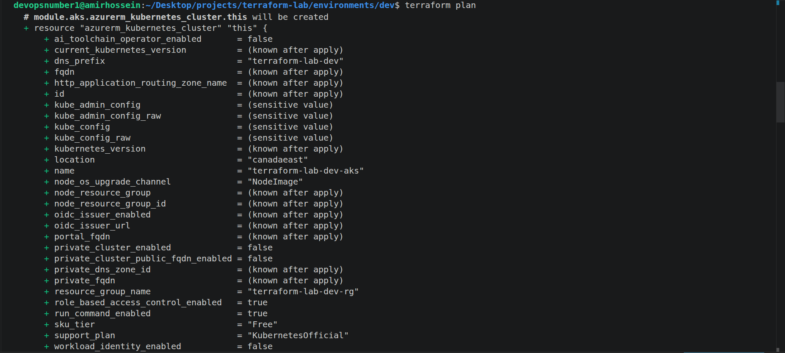
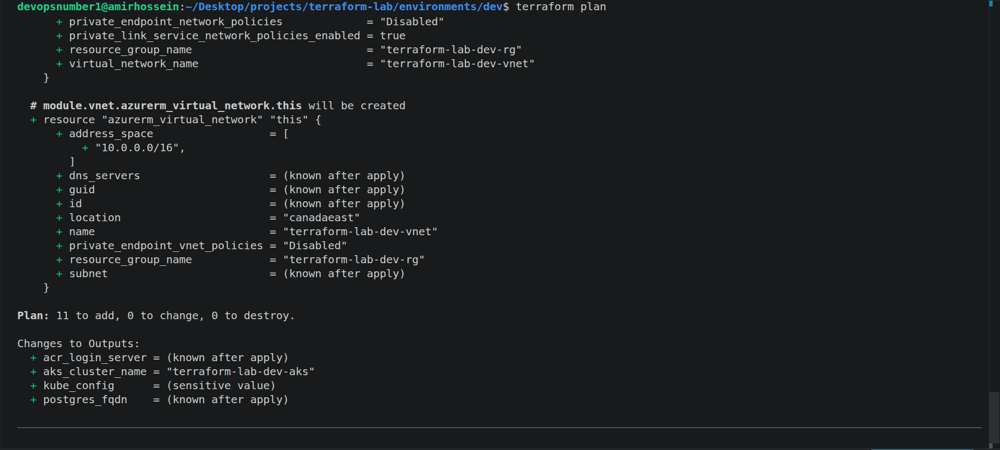
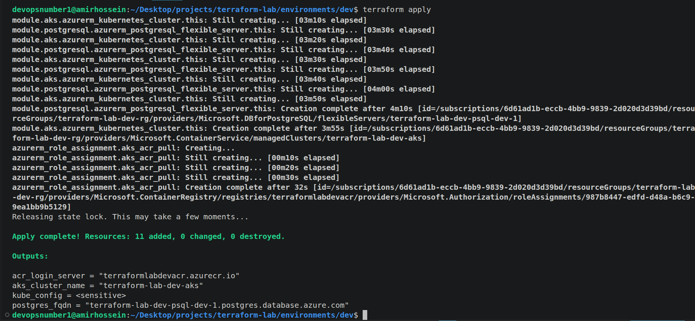
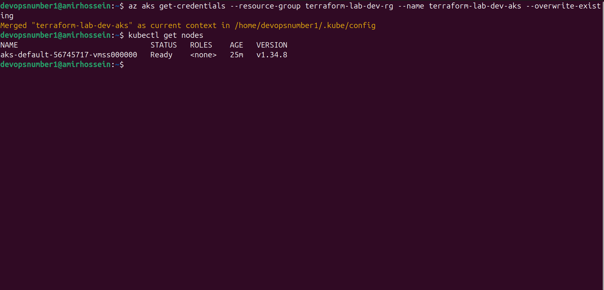
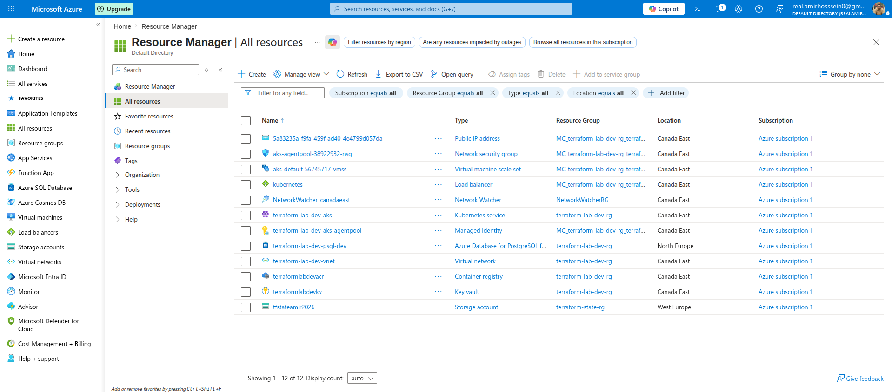

<div align="center">


&nbsp;&nbsp;&nbsp;


# terraform-lab

**Azure Infrastructure as Code — AKS, ACR, PostgreSQL, Key Vault**


-orange?style=flat-square)

</div>

---

## What is this?

A modular Terraform project that provisions a full Azure environment from scratch — networking, a managed Kubernetes cluster with autoscaling, a container registry, a managed PostgreSQL database, and a Key Vault that stores a Terraform-generated secret.

Every component is a reusable module. The `dev` environment is one composition of those modules — adding `staging` or `prod` is a matter of creating a new environment folder that calls the same modules with different variables.

---

## Architecture

```
environments/dev
   │
   ├── module.resource_group   ──► Resource Group
   ├── module.vnet             ──► VNet + Subnet
   ├── module.acr              ──► Container Registry
   ├── module.aks              ──► AKS (autoscaling 1-3 nodes)
   ├── random_password.postgres
   ├── module.postgresql       ──► PostgreSQL Flexible Server
   ├── module.keyvault         ──► Key Vault (stores generated password)
   └── azurerm_role_assignment ──► AKS → ACR pull permission

State: Azure Storage (azurerm backend) — remote, locked, never local
```

---

## Modules

| Module | Resource | Notes |
|---|---|---|
| `resource-group` | `azurerm_resource_group` | Base for everything |
| `vnet` | `azurerm_virtual_network` + `azurerm_subnet` | Single subnet, AKS-ready |
| `acr` | `azurerm_container_registry` | Basic SKU |
| `aks` | `azurerm_kubernetes_cluster` | Autoscaling node pool (1-3), SystemAssigned identity, custom `service_cidr` to avoid overlap with the VNet |
| `postgresql` | `azurerm_postgresql_flexible_server` | Burstable SKU, password generated by `random_password` (never hardcoded) |
| `keyvault` | `azurerm_key_vault` + secret | Stores the generated PostgreSQL password — no plaintext secret ever touches a `.tfvars` file |

---

## Region Strategy

This project's infrastructure spans multiple Azure regions due to **subscription-level restrictions** on a free-tier account — not a design choice:

| Resource | Region | Reason |
|---|---|---|
| AKS, ACR, VNet, Key Vault | **Canada East** | VM size and quota available for this free subscription |
| PostgreSQL Flexible Server | **North Europe** | `LocationIsOfferRestricted` error in every other region tested (West Europe, East US, Sweden Central) |
| Terraform Remote State (Storage Account) | **West Europe** | Created first, before the region constraints were discovered — kept stable and separate from infra on purpose |

In a paid subscription, application resources would normally live in a single region for lower latency. The remote state backend is intentionally kept independent — this is itself a Terraform best practice, not a workaround.

---

## Multi-Environment Ready

Because every resource is wrapped in a module, adding a new environment doesn't touch any module code:

```
environments/
├── dev/         ← exists
└── staging/     ← would just call the same modules
      main.tf          (same module calls, different names)
      variables.tf      (different sizes/SKUs if needed)
      terraform.tfvars  (different values)
```

No copy-pasting of resource blocks — only a new thin composition layer per environment.

---

## Secrets Strategy

```
random_password.postgres generates a 20-char password
        │
        ├──► passed to PostgreSQL as administrator_password
        └──► stored in Key Vault as a secret

No password is ever written to a .tf file, .tfvars file, or git.
```

This mirrors the same secrets-management philosophy as [vault-cicd-lab](https://github.com/amirhosssein0/vault-cicd-lab) — different platform (Azure Key Vault vs. HashiCorp Vault), same principle: secrets live in a vault, not in code.

---

## Screenshots

### terraform plan — AKS resource


### terraform plan — VNet + summary (11 to add)


### terraform apply — success


### kubectl get nodes — cluster is live


### Azure Portal — all resources created


---

## How to Run

### Prerequisites

- [Terraform](https://developer.hashicorp.com/terraform/install) >= 1.9
- [Azure CLI](https://learn.microsoft.com/cli/azure/install-azure-cli)
- An Azure subscription

### 1. Login to Azure

```bash
az login
```

### 2. Create the remote state backend (one-time, manual)

```bash
az group create --name terraform-state-rg --location westeurope

az storage account create \
  --name <unique-storage-name> \
  --resource-group terraform-state-rg \
  --sku Standard_LRS \
  --encryption-services blob

az storage container create \
  --name tfstate \
  --account-name <unique-storage-name>
```

Update `environments/dev/backend.tf` with your storage account name.

### 3. Initialize and apply

```bash
cd environments/dev
terraform init
terraform plan
terraform apply
```

### 4. Connect to the cluster

```bash
az aks get-credentials \
  --resource-group terraform-lab-dev-rg \
  --name terraform-lab-dev-aks

kubectl get nodes
```

### 5. Destroy when done (avoid charges)

```bash
terraform destroy
```

---

## Cost Control

This project was built and tested entirely within Azure's free-tier credit. The workflow used throughout development:

```
terraform apply   → test → screenshot → terraform destroy
```

No resource was left running between sessions.

---

<div align="center">
<sub>Part of a DevOps portfolio — <a href="https://github.com/amirhosssein0/k8s-gitops-lab">k8s-gitops-lab</a> | <a href="https://github.com/amirhosssein0/vault-cicd-lab">vault-cicd-lab</a></sub>
</div>